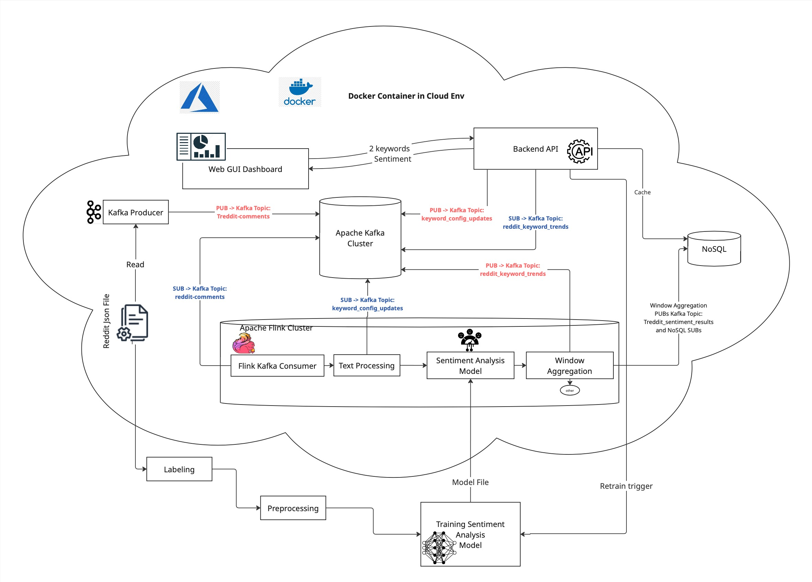

# Real-Time Reddit Sentiment Analysis System

This project provides a cloud-deployable, real-time sentiment analysis pipeline for Reddit comments using **Apache Kafka**, **Apache Flink**, and a **custom-trained ML model**. The system supports dynamic keyword tracking and delivers live sentiment trends via a web dashboard.

---

## Scenario: What Happens When a User Enters Keywords

A user wants to track public sentiment on Reddit regarding two keywords: **"Trump"** and **"Harris"**.

### 1. Continuous Data Ingestion
- A **Kafka Producer** streams Reddit comments (from a filtered JSON file) into the Kafka topic:
```Kafka Topic: reddit-comments```

---

### 2. Model Training (Offline Phase)
- A one-time **training pipeline** labels historical Reddit data using a sentiment lexicon.
- The labeled data is:
1. Preprocessed
2. Used to train a **Sentiment Analysis Model** from scratch
- The trained model is saved as a **model file** and deployed inside the Flink cluster.

---

### 3. Stream Processing in Flink (Real-Time Phase)

The Flink pipeline is continuously running and processes each new comment as follows:

| Step               | Description                                                                         |
|--------------------|-------------------------------------------------------------------------------------|
| Kafka Consumer     | Reads from `reddit-comments`                                                        |
| Text Processing    | Cleans the comment, preserves emojis, hashtags, etc.                                |
| Sentiment Model    | Applies the trained model to classify sentiment (`positive`, `negative`, `neutral`) |
| Window Aggregation | Groups sentiment results by keyword and 5-minute tumbling windows                   |

- The output of this stage is sent to two topics:
- `reddit_sentiment_results`: Single-comment predictions
- `reddit_keyword_trends`: Aggregated sentiment per keyword per time window

---

### 4. User Interaction

The **Web GUI Dashboard** allows users to:
- Enter 2 keywords (e.g., `"Trump"` and `"Harris"`)
- Optionally define a timeframe or the developer defines it as a fix value

The **Backend API**:
- Sends the keyword config to Flink via:

```Kafka Topic: keyword_config_updates```

- Subscribes to both sentiment topics:
- Filters and returns only the results related to the user-selected keywords
- Optionally caches results in a **NoSQL database** (for quick access or long-term analysis)

---

### 5. Dashboard Display

The GUI receives updates and shows:
- Sentiment score trend over time (line chart)
- Positive/negative comment counts (bar chart)
- Comparison between the two keywords

---

## Kafka Topics Summary

| Topic | Purpose |
|-------|---------|
| `reddit-comments` | Raw Reddit comment stream |
| `keyword_config_updates` | Keyword + timeframe input from user |
| `reddit_sentiment_results` | Per-comment sentiment result |
| `reddit_keyword_trends` | Aggregated sentiment per keyword per time window |

---

## Deployment

The entire architecture runs as **Docker containers** in the cloud (Azure-compatible), including:
- Kafka + Zookeeper
- Flink JobManager & TaskManager
- Model training + deployment logic
- Web GUI + Backend API

---

## Diagram Overview



---

## Technologies Used
- Apache Kafka
- Apache Flink
- Python (Scikit-learn or PyTorch for ML)
- Flask or FastAPI (for Backend API)
- ReactJS or plain JS (for Web GUI)
- NoSQL DB (e.g., MongoDB or DynamoDB)

---

## IaC Methods

We decided to use Terraform to deploy our cloud solution using a single script. This approach simplifies infrastructure management, reduces development overhead, and allows us to consistently deploy the entire system on demand.